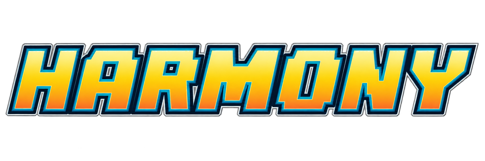

# Digimon World 2003: Harmony



A community mod compilation for **Digimon World 2003 (Europe / PAL, SLES-03936)**, assembled and extended by **rsigrist**. Includes Flawe's Mod 2.0, guiomatos' Initial Pack Customizer enhancements, markisha64's patches, and additional interface and progression improvements.

**Patch only. Each player must provide their own original, legally obtained copy of the game and dump it themselves. No game image, BIOS, or standalone game assets are provided.** This patch does not work with the North American *Digimon World 3* release.

[Download the release](https://github.com/rsigristc/dw2003-qol-patch/releases/latest) · [Support Rodrigo on Ko-fi](https://ko-fi.com/rodrigosigrist)

## How to patch

1. Back up your original disc dump and memory cards.
2. Download `dw2003-harmony-betav1.bps` from Releases or the `patches/` folder.
3. Verify your **unmodified European BIN** matches the source below. Apply this complete patch directly to the original BIN, with no earlier mods applied. Do not patch the CUE file, a compressed image, or an already patched BIN.
4. Open [Rom Patcher JS](https://www.marcrobledo.com/RomPatcher.js/), select your original BIN as the ROM file, and the BPS as the patch file. Apply the patch with checksum verification enabled and save the output to a new file. Large disc images may require a desktop BPS-compatible patcher if your browser runs out of memory.
5. Keep your original CUE and update its `FILE` entry to reference the new BIN filename, preserving its track definitions. Load that CUE in your emulator.
6. Boot the game normally. Load a memory-card save instead of a save state made with an earlier build. Start a new game to use the starter team selection and Fast Start features.

If the patcher reports a source mismatch, stop and check the edition, dump format, size, and hash. Do not bypass verification.

### Required original BIN

- Edition: Digimon World 2003 (Europe), SLES-03936.
- Size: **692,146,560 bytes**.
- CRC32: `007df18e`.
- SHA-256: `fb70dc9a995aed628cf515cabc87c7b14e5142559076ec394dfe793ec3e26a04`.

On Windows PowerShell:

```powershell
Get-FileHash -Algorithm SHA256 -LiteralPath 'Digimon World 2003 (Europe).bin'
```

### Expected patched BIN

- Size: **694,863,120 bytes**.
- CRC32: `59c3ce5b`.
- SHA-256: `2b896a24dcec4d47e31dd04405e72bd38640dc9cc66bbf113a8da17ba1e920fb`.
- BPS SHA-256: `9e816a8e2c40fb85eb161f6f5e25fe48f08a02b8925fa5316cc939a93cb6a8c6`.

The JSON manifest records build metadata and hashes. The draft JSON records the build recipe; neither JSON file is a patcher input.

## Second Beta v1.0 — Digimon World 2003: Harmony

The project is now **Digimon World 2003: Harmony**. Work continues to make the game more enjoyable and approachable for everyone, with training without RNG, faster loading and saving, new items, improved systems, and fixes from the previous beta.

### Training rebuilt

- Remove RNG from training results. Base stat gains are guaranteed even if you fail the minigame.
- Stop the cursor in the green zone in the new timing minigame for extra stat bonuses.
- Fast Training skips the minigame and grants base gains without the additional bonus.
- Training descriptions explain how each stat helps your Digimon.

### Menus, loading, and saving

- Improve loading and transitions when entering and leaving menus.
- Saving/loading reductions from around 15–20 seconds to under 5 seconds have been reported. Results vary by setup; timing measurement in DuckStation remains pending for this r15 build.
- Remove redundant location screens after battles, after leaving the save menu, and when returning from the full Start menu to the same map. Preserve labels when changing maps.
- Start-menu saves display the correct location instead of Asuka Inn.
- Battle menus remember previous selections, including Techniques instead of resetting to Attack.
- Fix the map glitch when pressing Square during exploration.

### Digivolutions and battles

- Add the first experimental custom Digivolution line for Agumon, with battle camera scenes and 3D battle portraits. Development continues; stats and abilities may contain inconsistencies.
- Add a DigiLab Digivolution routes interface showing requirements.
- Display the active Digivolution name in battle instead of the Rookie name.
- Customize technique order per Digimon/Digivolution: open Techniques in battle, press Select, move with Up/Down or L1/R1, and confirm with X or Select.
- Fix Picking Claw and Snapping Claw when an enemy is KO'd and improve their descriptions.
- Display actual technique power values.
- Show a Share EXP activation notification after defeating Leader Seiryu.

### New items

All 15 test items cost **1 BIT** at the initial Gargomon shop and the first item shop. English names below are descriptive translations.

- **Lure Disk:** encounters ×1.25 for 300 steps.
- **Frenzy Disk:** encounters ×3 for 300 steps.
- **Repellent Disk:** encounters ×0.5 for 300 steps.
- **Stealth Disk:** no random encounters for 300 steps.
- **Lure Ring:** encounters ×1.25 while equipped.
- **Repellent Ring:** encounters ×0.5 while equipped.
- **DV Adapter:** +20% DV EXP for the form used in battle.
- **Apprentice Ring:** +15% Share EXP for the wearer; does not stack with EXP Adapter.
- **Analysis Disk:** reveal enemy resistances and stealable-item availability for 5 battles. Analysis becomes permanent after defeating Byakko. L1/R1 changes pages; Select shows/hides analysis from main battle commands.
- **Reserve Ring:** restore 10% of maximum MP after winning a battle.
- **Risk Ring:** +15% damage dealt and received.
- **Tenacity Ring:** survive a lethal hit with 1 HP once per battle, provided HP was above 50% before the hit.
- **Three MP recovery consumables:** restore 25%, 50%, or 100% of maximum MP in exploration or battle.
- Notify when encounter effects expire and when battle item bonuses apply.

### Visuals and fixes

- Restore light-blue borders for Flawe's walkthrough and the exploration Quest Log.
- Make shadows transparent instead of solid black circles.
- Correct battle reward text from “1IT”/“1EXP” to “BIT”/“EXP”.

### Languages and compatibility

All changes cover English, Spanish, French, German, and Italian. Gameplay testing has only been carried out in English and Spanish. Added text in other languages uses a text translation tool and may contain wording, spelling, or grammatical errors.

Apply `dw2003-harmony-betav1.bps` directly to the original unmodified PAL BIN. This is the supplied October 7 r15 build, renamed without changing the patch bytes. Manifest and draft retain the original internal name for provenance.

Back up memory cards. Restart from boot; use memory-card saves instead of older save states. KIT2 saves migrate to KIT3 on loading and saving. KIT3 saves require r15 or later; physical memory-card file size is unchanged. Full emulator playthrough and visual validation remain pending. Automated checks do not establish bug-free gameplay.

### Next Steps

Rework Intelligence/Wisdom-focused Digimon and techniques, supported by the newly implemented MP recovery disks and MP recovery ring. Develop custom Digivolution lines for the remaining Rookies and further rebalance Digivolution stats and techniques to make more team compositions and playstyles rewarding.

### Related projects

Harmony complements the [DS Companion for Android](https://github.com/rsigristc/DW3-DS-Android). See the [first beta announcement](https://www.reddit.com/r/DigimonWorld/comments/1wzc6e0/digimon_world_2003_qol_new_systems_mod_for_psx/) for the original feature overview.

Bug reports, balance feedback, and translation corrections are welcome through [GitHub Issues](https://github.com/rsigristc/dw2003-qol-patch/issues). Include patch version, language, emulator/hardware, reproduction steps, and whether you started a new game or loaded a save.

## Features carried forward from the first beta

### Battle and progression

- Restore partner Digimon HP and MP when leveling up.
- Faster battle text and reduced redundant messages from **Flawe's Mod**.
- Display enemy HP during battle.
- Always display partner MP without opening the Techniques menu.
- Display technique attributes, power, and MP cost. Effective attributes appear blue, ineffective attributes red, and neutral attributes without a color highlight. Insufficient MP appears red.
- Display partner stats and attributes in the battle DV menu, with the strongest resistance in blue and the weakest in red.
- Show EXP required for the next level after each battle, and DV EXP beside Digivolutions.
- Show the active Digivolution's DV EXP beside partner EXP in the status window, and beside Digivolution names.
- Increase global EXP gain to **×1.3** and DV EXP gain to **×1.2**.
- Unlock **Share EXP** after defeating Leader Seiryu. Partners who do not participate receive an additional one-third of the battle's total EXP. EXP Adapter also increases shared EXP. Shared EXP does not grant DV EXP; participation is required for DV EXP.
- **Fixed Field Moves:** correct the element applied by battle field moves.
- **Uncapped Digivolution EXP:** remove the 10/50 DV EXP caps before applying the ×1.2 multiplier, while preserving the level 99 ceiling and accumulated EXP limit.
- **Improved HP Proxy:** reduce damage by 10%/20% instead of a fixed 10/20 points.

### Exploration, guidance, and menus

- **Flawe's Fast Travel** and **In-Game Walkthrough**, accessible through the game menus.
- Extend the walkthrough to all five PAL languages: English, French, Italian, German, and Spanish.
- Show a mission log in the upper-right corner during exploration, summarizing Flawe's walkthrough. Press **Circle** to show or hide it.
- Press **Square** during exploration to open the map for quick access to fast travel. On the map, use **X** to select a destination and exit the menu to travel; **Square** switches server maps.
- NPC bubbles identify available quests, Digimon battles, and card battles.
- Press **L1/R1** during exploration to change the leader Digimon.
- Show notifications when an auction or DRI event becomes available.
- Show Digivolution requirements for each Digimon in the DigiLab.
- Add item bonuses and stats to descriptions in shops and the equipment menu.
- Add a **Save** option to the Start menu using the native memory-card interface. Saving remains subject to gameplay restrictions, such as active events or battles.
- Speed up map transitions and save-menu animations.
- Increase the player name limit from 8 to **10 characters**.

### New game and story flow

- Extend **guiomatos' Initial Pack Customizer** with **Pack D**, allowing a custom starter team while keeping Packs A/B/C. Add a Veemon description and support for the first summon scene reflecting the selected team.
- **Fast Start:** retain player naming and starter pack selection, then begin directly in Asuka, skipping the introduction and initial summon event. Consequently, the custom summon scene is skipped in this combined build.
- Allow postgame content to trigger without epic weapons.
- Make Baronmon/TNT accessible without first visiting Phoenix Bay.
- Make the Admin Center accessible after A.o.A. Ambusher.
- Skip the Folder Bag scene while preserving its progression callback.

### Video timing

- Apply the **NTSC 60 Hz patch** for native video mode and timing. This does **not** mean every scene renders at 60 frames per second.

## Release notes and limitations

This second beta packages the supplied **October 7, 2026 r15 menu-analysis build**, renamed as `dw2003-harmony-betav1.bps` and identified by its manifest. The feature list above documents the intended mod behavior; it is not a claim of exhaustive hardware or emulator playtesting.

- Flawe's walkthrough covers the main story, not side quests or postgame guidance.
- Flawe's upstream notes warn that traveling outside the normal postgame area can leave NPCs absent; entering underground or underwater areas there can crash the game. These routes are not declared fixed by this release.
- Back up memory cards when changing builds. For the first test of Start-menu saving, use a free slot and verify that the save loads after restarting.
- Faster transitions and animations do not eliminate actual disc or memory-card I/O time.
- See [CHANGELOG.md](CHANGELOG.md) and [CREDITS.md](CREDITS.md) for release provenance and attribution.

## Credits and rights

**Flawe**, **guiomatos**, **rsigrist**, and **markisha64 / Marko Grizelj** receive credit for their respective contributions. EmeraldPhoenix is credited for the walkthrough on which Flawe's guide is based. Full attribution and third-party notices are in [CREDITS.md](CREDITS.md) and [LICENSE-NOTICE.md](LICENSE-NOTICE.md).

Digimon and Digimon World 2003 belong to their respective rights holders, including Bandai / Bandai Namco, Akiyoshi Hongo, and Toei Animation. Original game development credits include BEC and Boom Corp. PlayStation belongs to Sony Interactive Entertainment. This is an unofficial fan project with no affiliation, endorsement, or grant of rights to the original game.

## Support

If you enjoy my improvements and integration work, you can [support me on Ko-fi](https://ko-fi.com/rodrigosigrist). Donations are optional to support my work; you won't purchase the game, grant game rights, or imply that upstream authors receive a share.

Report issues through [GitHub Issues](https://github.com/rsigristc/dw2003-qol-patch/issues), including your emulator/version, selected language, reproduction steps, and the patch version. Do not upload disc images, BIOS files, or copyrighted game assets.
